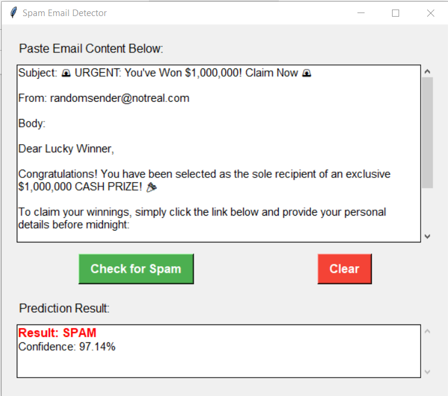

# 🛡️ Email Spam Detector 2025

A simple yet effective machine learning-based email spam detection system with a user-friendly GUI built using Tkinter. This tool classifies emails as "Spam" or "Not Spam" based on their content using a trained Naive Bayes classifier.

---

## ✨ Features

- 📩 Classifies emails as Spam or Not Spam
- 🧠 Machine Learning powered (Multinomial Naive Bayes)
- 🖥️ Easy-to-use Tkinter-based GUI
- 💾 Pretrained model with vectorizer (`.pkl` files)
- 📊 Jupyter Notebook for training and experimentation

---

## 📸 GUI Preview



> _Make sure to create a `screenshots/` folder and place a screenshot of the GUI as `gui_preview.png`._

---

## 🚀 Getting Started

### Prerequisites

- Python 3.x
- pip

### Installation

1. Clone the repository:
   ```bash
   git clone https://github.com/Developer-codespace/email-spam-detector-2025.git
   cd email-spam-detector-2025
